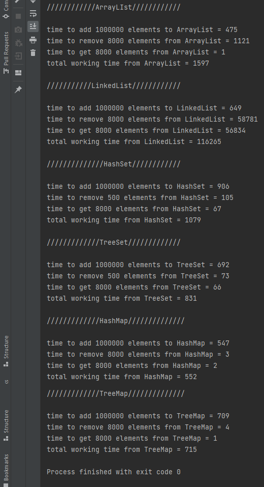

# Time comparison of data structures

## Description
The program was created to view the running time of Arraylist, Linkedlist, HashSet,
TreeSet, HashMap and TreeMap depending on the number of elements added,
removed and retrieved.

Also, the purpose of creating the program was to gain knowledge for working with the
above data structures.

## Main classes
1. Person
2. AbstractHandler
3. ListHandler
4. MapHandler
5. SetHandler
6. RandomUtils

## Description of program classes

Person - stores information about a person, such as: name, age, id.

AbstractHandler - this is an abstract class that contains methods such as:
* add(int amountElements) - to add the specified number of elements
* remove(int amountElements) - to remove the specified number of elements
* get(int amountElements) - to get the specified number of elements

ListHandler - a class that extends by AbstractHandler and uses its methods to
adding, removing and getting elements.

MapHandler - a class that extends by AbstractHandler and uses its methods to
adding, removing and getting elements.

SetHandler - a class that contains methods like:
* add() - to add elements
* remove(int amountElements) - to remove the specified number of elements
* get(int amountElements) - to get the specified number of elements

RandomUtils - a class that contains helper methods, such as:
* randomNumber(int max) - to generate a random number from 0 to the specified
* randomChar() - to generate a random letter
* getRandomElements(int amountElements, Collection<Person> collection) - for sampling
the specified number of random elements from the collection

## Program example

